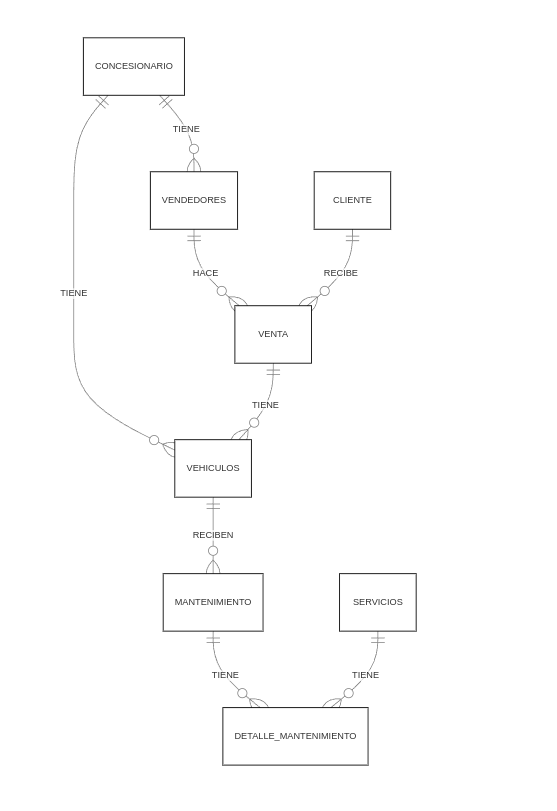

# Modelo Conceptual

## Relaciones
- Un concesionario tiene muchos vendedores
- Un concesionario tiene muchos vehículos
- Un vendedor puede hacer muchas ventas
- Una venta tiene un detalle de venta, cada detalle de venta puede tener muchos vehículos asociados.
- Un vehículo puede recibir varios servicios de mantenimiento, cada vehículo tiene un detalle de mantenimiento.
- Un cliente hace varias compras(ventas)
